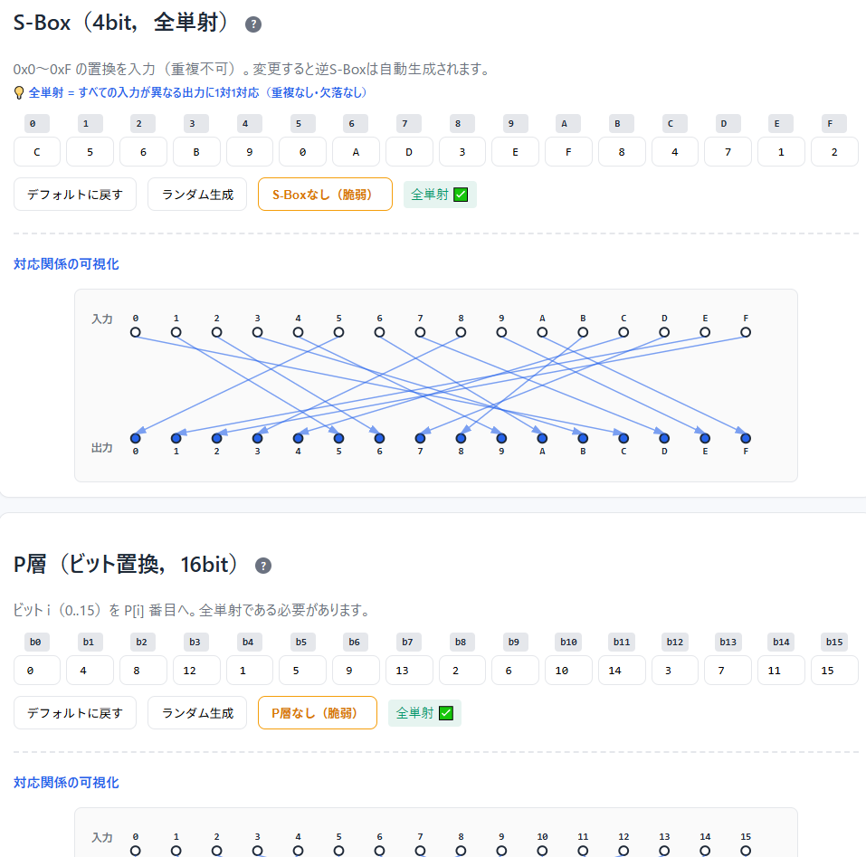
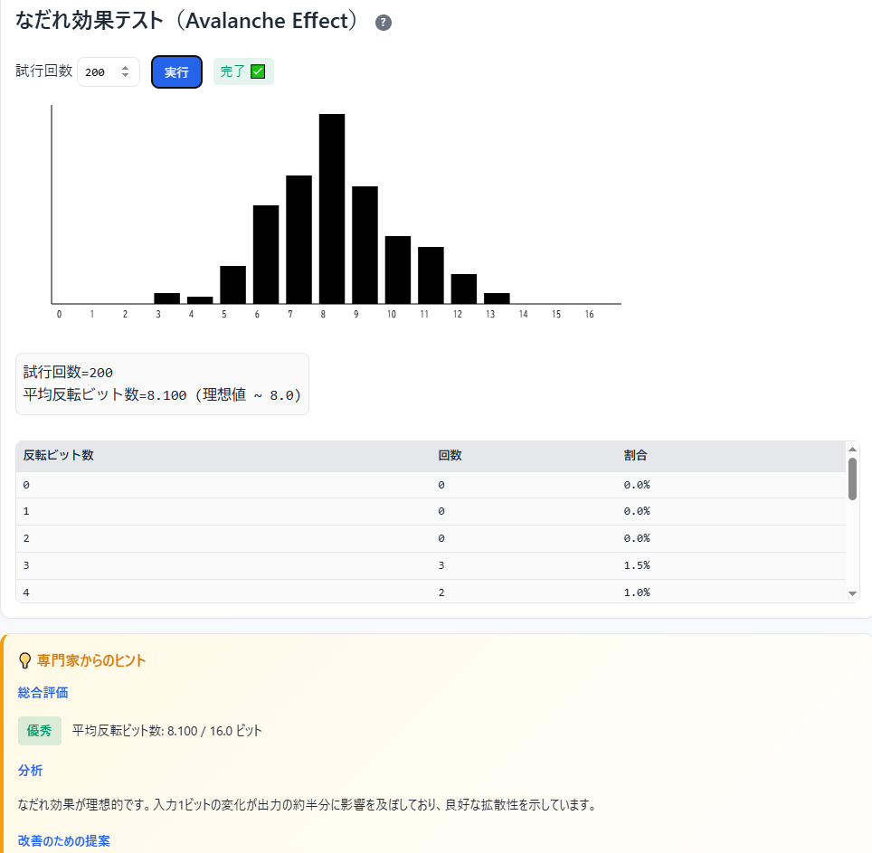

<!--
---
id: day094
slug: toyspn-builder

title: "ToySPN Builder"

subtitle_ja: "SPN体験ミニツール"
subtitle_en: "Interactive SPN Block Cipher Learning Tool"

description_ja: "S-Box・P層・鍵加算からなるSPN（Substitution-Permutation Network）構造を自分で設計・実行し、暗号化ステップの可視化やアバランシェ効果テストで現代ブロック暗号の基礎を体感できる教育用Webツール"
description_en: "An educational web tool to design and run a minimal SPN (Substitution-Permutation Network) block cipher with step-by-step encryption visualization and avalanche effect testing"

category_ja:
  - 現代暗号
  - ブロック暗号
category_en:
  - Modern Cryptography
  - Block Cipher

difficulty: 4

tags:
  - SPN
  - block-cipher
  - S-box
  - permutation
  - avalanche-effect
  - cryptography
  - education
  - javascript

repo_url: "https://github.com/ipusiron/toyspn-builder"
demo_url: "https://ipusiron.github.io/toyspn-builder/"

hub: true
---
-->

# ToySPN Builder - SPN体験ミニツール


[](https://ipusiron.github.io/toyspn-builder/)

**Day094 - 生成AIで作るセキュリティツール100**

**ToySPN Builder** は、**「S-Box（全単射）で非線形化 ⇒ 線形行列（ビット置換）で拡散 ⇒ ラウンド鍵加算（XOR）」** という **SPN（Substitution–Permutation Network）** の最小構成を自分でいじりながら体験できる教育用Webツールです。

ヒル暗号の線形性という課題を **S-Box** で補い、 **「古典暗号⇒現代暗号」** の橋渡し教材として設計しています。

---

## 🌐 デモページ

👉 **[https://ipusiron.github.io/toyspn-builder/](https://ipusiron.github.io/toyspn-builder/)**

ブラウザーで直接お試しいただけます。

---

## 🎯 対象ユーザー

本ツールは以下のような方々に最適です：

- **暗号学を学び始めた学生**
  大学・高専・専門学校で暗号理論を学んでいて、ブロック暗号の内部構造を実際に動かして理解したい方

- **情報セキュリティ初学者**
  セキュリティエンジニアを目指していて、AESなどの現代暗号がどのような仕組みで動いているか基礎から学びたい方

- **古典暗号から現代暗号への移行を学びたい方**
  ヒル暗号やシーザー暗号などの古典暗号を学んだ後、「なぜ現代暗号は強いのか」を体感的に理解したい方

- **暗号学の教育者・講師**
  SPN構造やアバランシェ効果を視覚的に説明したい教員・講師の方、実習教材として利用したい方

- **プログラマー・エンジニア**
  暗号ライブラリを使っているが、内部でどんな処理が行われているか興味がある方

- **暗号アルゴリズムを自作してみたい方**
  S-BoxやP層のパラメーターを変えて、自分だけの暗号を設計・評価してみたい方

- **数学と実装の橋渡しを求めている方**
  暗号の数学的理論は学んだが、実際のビット演算や状態遷移を可視化して理解したい方

---

## 📸 スクリーンショット

>
>*S-boxの構築*
>
>
>*ミニSPN構造のなだれ効果テスト*

---

## 🌉 ヒル暗号からToySPN Builderへの橋わたし 〜古典のしくみから現代暗号の考え方へ〜

### 1️⃣ ヒル暗号ってどんなもの？

ヒル暗号は、 **行列（マトリックス）** を使って文字を変換する暗号です。  
文字を数字に変えて、次のような計算をします。

```
暗号文 = 鍵行列 × 平文（mod 26）
```

たとえば「A=0, B=1, …, Z=25」として計算します。  
ただし、この方法には弱点があります。  

計算が **完全に線形（まっすぐ）** なので、数学で解くこと（連立方程式を立てること）ができてしまうのです。
つまり、仕組みを知っている人には **解読が簡単すぎる** という問題があります。

実際にヒル暗号ツールである[Hill CipherLab](https://ipusiron.github.io/hill-cipherlab/)を試してもらうことで実感できるはずです。

---

### 2️⃣ 現代の暗号は「非線形」がカギ

現代のブロック暗号（AESなど）では、ヒル暗号のように単純な計算を **少しひねって** 使っています。

そのための工夫が次の3つです。

1. **S-Box（エスボックス）**：  
   数を「まっすぐ」変えるのではなく、 **入れかえ（置換）** で変える。  
   これで **非線形（ねじれた）** 変換になります。

2. **P層（Permutation Layer）**：  
   ビットの位置をぐちゃぐちゃに**並べかえる**。  
   1か所の変化が全体に広がる＝ **拡散（diffusion）** が起きる。

3. **AddRoundKey（鍵の追加）**：  
   鍵とデータを **XOR（排他的論理和）** という方法で混ぜる。  
   これは「暗号化」と「復号」がちょうど逆になる便利な操作です。

---

### 3️⃣ ToySPN Builderでは何をしているの？
本ツールは、その3つを組み合わせた**ミニ暗号マシン**です。

1. **S-Box**：4ビットの数字（0〜15）を入れかえる。  
   たとえば「0→C、1→5、2→6…」のような表を使います。  
   これが**非線形**の部分。

2. **P層**：16個のビットの位置を入れかえる。  
   これが**線形の拡散**の部分。  
   （ヒル暗号の「行列による拡散」と同じ考え方です）

3. **AddRoundKey**：ラウンドごとに鍵を混ぜる。  
   何回か繰り返す（ラウンドを重ねる）ことで、  
   情報がどんどん混ざっていきます。

---

### 4️⃣ ヒル暗号とのちがい・つながり

| 比べるポイント | ヒル暗号 | ToySPN Builder |
|----------------|-----------|----------------|
| 変換の種類 | 線形（行列計算だけ） | 非線形（S-Box）＋線形（P層）＋鍵XOR |
| 拡散 | 行列の掛け算で行う | ビットの並べかえで行う |
| 鍵の使い方 | 行列そのものが鍵 | 毎ラウンドの鍵をXORで混ぜる |
| 可逆性（もとに戻せる） | 行列が可逆なら復号できる | SとPが全単射なら復号できる |
| 強さ | 弱い（数式で解ける） | 強い（ねじれ＋混合で解析が難しい） |

> 🧩 共通点：  
> どちらも「逆向きに計算できる（可逆）」ことが大事。  
>  
> ヒル暗号は「行列が可逆」なら復号できます。
> 一方、ToySPNは「S-BoxとP層が全単射」なら復号できます。

---

### 5️⃣ なぜ「非線形」が大事なの？

もしすべてが線形なら、暗号の内部を「数式で書ける＝解ける」ことを意味します。
S-Boxのように「ねじれ」を入れることで、簡単な式では表せなくなり、**攻撃に強くなる**のです。

ToySPN Builderでは、この「ねじれ」を自分で変えて、暗号の性質（どのくらい全体が変わるか）を観察できます。

---

### 6️⃣ 「アバランシェ効果（なだれ効果）」を見てみよう

1ビットだけ入力を変えたとき、出力のビットがどれだけ変わるかを測るのが **アバランシェ効果（なだれ効果、Avalanche Effect）テスト** です。

理想的には、1ビット変えると出力の **半分（8ビット）** が変わります。  
ツールの「Analysis」タブでこの実験ができます。  
- SやPを変えると平均値が下がる  
- ラウンドを増やすと平均が8に近づく  
→ つまり「よく混ざる」ほど、暗号として良い拡散が起きている！

---

### 7️⃣ まとめ

- ヒル暗号は「線形変換」だけのシンプルな暗号。  
- ToySPN Builderはそこに「非線形（S-Box）」と「拡散（P層）」を加えた進化版。  
- これが現代のブロック暗号（AESなど）につながる基本構造です。

> 💡つまり本ツールは「古典暗号 → 現代暗号」の橋を渡るためのミニ実験室なんです。

---

## 📚 本ツールの活用シナリオ

本ツールを使った具体的な学習・実験シナリオを3つ紹介します。

### 🧪 シナリオ1: S-Boxの重要性を体感する

**目的**: 非線形変換がなぜ必要かを実験的に理解する

**手順**:
1. デフォルト設定でなだれ効果テストを実行 → 結果をメモ
2. 「**S-Boxなし（脆弱）**」ボタンをクリック
3. 再度なだれ効果テストを実行 → 結果を比較
4. 専門家ヒントを読んで、何が問題か確認

**期待される結果**:
- S-Boxなしの場合、平均反転ビット数が大幅に減少
- 専門家ヒントで「不合格」または「要改善」判定
- 可視化図で全矢印が垂直（入力＝出力）になり、置換が起きていないことが一目瞭然

**学習ポイント**:
ヒル暗号のような線形暗号の弱点を体感。S-Boxによる非線形変換が現代暗号の核心であることを理解できます。

---

### 🔬 シナリオ2: ラウンド数と拡散性能の関係を調べる

**目的**: ラウンドを重ねることで拡散性能がどう向上するかを観察する

**手順**:
1. 「**ラウンド最小1（脆弱）**」をクリック → なだれ効果テスト実行
2. ラウンド数を4に変更 → なだれ効果テスト実行
3. デフォルトの8ラウンドで実行
4. 「**ラウンド最大16**」をクリック → なだれ効果テスト実行
5. 各結果の平均反転ビット数をグラフ化（手動でも可）

**期待される結果**:
- ラウンド1: 平均2〜4ビット程度（拡散不足）
- ラウンド4: 平均5〜6ビット程度
- ラウンド8: 平均7〜8ビット程度（理想に近い）
- ラウンド16: 平均8.0±0.3程度（ほぼ理想）

**学習ポイント**:
ラウンドを重ねるごとに拡散が改善され、理想値（8.0）に収束していく様子を観察。AESが10〜14ラウンドを採用する理由が体感的に理解できます。

---

### 🎨 シナリオ3: 自分だけの暗号を設計して評価する

**目的**: S-BoxとP層を自由に設計し、暗号学的性能を評価する

**手順**:
1. S-Boxの「**ランダム生成**」をクリック → 可視化図を観察
2. P層も「**ランダム生成**」をクリック → 可視化図を観察
3. マスター鍵も「**ランダム生成**」をクリック
4. 「**🔍 設定を検証**」で全単射性を確認
5. 暗号化/復号タブでテスト（例: 平文「1234」）
6. なだれ効果テストを実行 → 専門家ヒントを確認
7. 結果が「要改善」以下なら、P層を再設計して再テスト

**期待される結果**:
- ランダム設定でも全単射が保証されるため、必ず復号可能
- S-BoxとP層の組み合わせによって、なだれ効果が変動
- 良い組み合わせを見つけると「優秀」または「良好」判定

**学習ポイント**:
暗号の設計は「トライ＆エラー」であることを体験。ランダムな設計でも全単射さえ満たせば動作するが、良好な拡散性能を得るには工夫が必要であることを実感できます。実際のAES S-Boxも数学的最適化を経て設計されていることの意味が分かります。

---

## ✨ 本ツールの機能

### 🎨 設計機能
- **S-Box設計（4bit, 全単射）**
  - 16要素の置換表を自由に編集
  - 逆S-Box自動生成
  - ランダム生成ボタン
  - 恒等写像（脆弱）ボタンで非線形変換なしの状態を体験
  - 入力→出力の対応関係をSVGで可視化

- **P層設計（16ビット置換）**
  - 16個のビット位置を自由に編集
  - 逆置換自動生成
  - ランダム生成ボタン
  - 恒等写像（脆弱）ボタンで拡散なしの状態を体験
  - ビット位置の対応関係をSVGで可視化

- **ラウンド数設定**
  - 1〜16ラウンドまで設定可能（デフォルト: 8）
  - ワンクリックで最小1（脆弱）・最大16に変更可能

- **マスター鍵設定**
  - 16ビット（16進数4桁）の鍵を設定
  - ランダム生成ボタン

- **設定検証機能**
  - S-Box/P層の全単射性チェック
  - ラウンド鍵の自動生成・表示
  - 総合判定（暗号化可能/設定エラー）

### 🔐 暗号化/復号機能
- **16-bitブロック暗号**（4ニブル）
- **ステップバイステップ可視化**
  - 各ラウンドの状態遷移を詳細表示
  - S-Box適用後 → P層適用後 → 鍵加算後の各段階を確認可能
- **簡易鍵スケジュール**（左回転 + ラウンド定数XOR）

### 📊 解析機能
- **なだれ効果テスト（Avalanche Effect）**
  - 1ビット入力差で出力変化ビット数の分布を測定
  - 平均反転ビット数の計算（理想値: 8.0）
  - ヒストグラム可視化（キャンバス + データテーブル）
  - 💡 **専門家からのヒント**
    - 4段階評価（優秀/良好/要改善/不合格）
    - 分析コメント
    - 改善提案

### 🎓 学習機能
- **アコーディオン式の座学コンテンツ**
  - SPN構造の基礎
  - S-Boxの役割と設計原理
  - P層の拡散メカニズム
  - 鍵スケジュール
  - なだれ効果（アバランシェ効果）の詳細
  - ブロック暗号の歴史
  - 本ツールの限界と実用暗号との違い

### 🛡️ セキュリティ・品質
- XSS対策（innerHTML不使用、textContent/createElement使用）
- 厳格な入力バリデーション
- Content Security Policy (CSP)
- セキュリティヘッダー（X-Content-Type-Options, X-Frame-Options等）
- 依存なし（純HTML/CSS/JS）、オフライン動作可能

---

## 🚀 クイックスタート

### 基本的な使い方

1. **設計タブ**でパラメーターを確認
   - S-Box（0〜Fの16個の値）
   - P層（b0〜b15のビット位置）
   - ラウンド数（1〜16、デフォルト8）
   - マスター鍵（16進数4桁）
   - 「🔍 設定を検証」で全単射性をチェック

2. **暗号化/復号タブ**で動作確認
   - 平文を16進数4桁で入力（例: `1234`）
   - 「暗号化」ボタンでステップ表示
   - 暗号文を確認
   - 「復号」ボタンで平文に戻ることを確認

3. **解析タブ**で性能評価
   - 「なだれ効果テストを実行」をクリック
   - ヒストグラムと平均反転ビット数を確認
   - 専門家からのヒントで評価を確認

4. **学習タブ**で理論を学ぶ
   - アコーディオンメニューから興味のあるトピックを選択
   - SPN構造やアバランシェ効果の詳細を理解

### 実験的な使い方

- **ランダム生成**ボタンで新しいS-BoxやP層を試す
- **脆弱ボタン**（S-Boxなし、P層なし、ラウンド最小1）で弱い暗号を体験
- なだれ効果の結果を比較して、各要素の重要性を実感

---

## ⚙️ ミニSPNのアルゴリズム

- 状態は 16-bit。毎ラウンド：
  1. **SubNib**：各4-bitニブルに S-Box を適用  
  2. **PermuteBits**：ビット位置の全単射置換（線形）  
  3. **AddRoundKey**：ラウンド鍵と XOR  
- 復号は逆順で **XOR → InvP → InvS**  
- 鍵スケジュールは 16-bit master key を **左回転＋ラウンド定数XOR** で生成

> S は置換（全単射）、P は置換行列（可逆）、AddRoundKey は XOR。  
> いずれも **可逆** であることが復号の必要条件です。

---

## 🔧 デフォルトパラメーター

- **S**:  
  `S = [C,5,6,B,9,0,A,D,3,E,F,8,4,7,1,2]`（16進）  
  ※ UIで自由に編集可。逆写像は自動。
- **P**:  
  `P = [0,4,8,12, 1,5,9,13, 2,6,10,14, 3,7,11,15]`（bit 0..15 → P[i]へ）  
- **Rounds**: 8  
- **Master Key**: 16bit（例: `C0DE`）

---

## ⚠️ 制限事項

- 教育用。ブロックが小さく、ラウンドも少ないため実運用は不可。  
- ECBデモはパターン露出の教材用。  
- 強度を上げる場合：ブロック拡張、ラウンド増、鍵スケジュール強化、より強いP（MDS近似）やSの設計原理（差分/線形耐性）を導入。

---

## 📁 ディレクトリー構成

```
toyspn-builder/
├── index.html          # メインHTML（4タブ構成）
├── style.css           # スタイルシート
├── js/
│   ├── core.js        # 暗号化コアロジック（SPN実装）
│   ├── analysis.js    # なだれ効果テスト・ヒストグラム描画
│   └── ui.js          # UI制御・イベントハンドラ
├── assets/
│   ├── screenshot.png  # S-box構築のスクリーンショット
│   └── screenshot2.png # なだれ効果テストのスクリーンショット
├── README.md           # 本ファイル
├── TECHNICAL.md        # 技術仕様書（開発者向け詳細）
├── CLAUDE.md           # Claude Code用ガイド
├── SECURITY.md         # セキュリティ対策ドキュメント
└── LICENSE             # MITライセンス
```

---

## 👨‍💻 開発者向け情報

本ツールの技術的な実装の詳細、アルゴリズム、設計上の工夫については、以下のドキュメントを参照してください：

📖 **[技術仕様書（TECHNICAL.md）](TECHNICAL.md)**

主な内容:
- コアアルゴリズムの実装詳細（ビット置換、S-Box、鍵スケジュール）
- セキュリティ実装（XSS対策、入力バリデーション、CSP）
- パフォーマンス最適化（アバランシェテスト、SVG描画）
- UI/UX設計の工夫（リアルタイム検証、専門家ヒント）
- 数学的背景（可逆性の証明、アバランシェ効果の理論）
- Fisher-Yatesシャッフル、暗号学的乱数生成

---

## 📄 ライセンス

MIT License – 詳細は [LICENSE](LICENSE) を参照してください。

---

## 🛠️ このツールについて

本ツールは、「生成AIで作るセキュリティツール100」プロジェクトの一環として開発されました。
このプロジェクトでは、AIの支援を活用しながら、セキュリティに関連するさまざまなツールを100日間にわたり制作・公開していく取り組みを行っています。

プロジェクトの詳細や他のツールについては、以下のページをご覧ください。

🔗 [https://akademeia.info/?page_id=42163](https://akademeia.info/?page_id=42163)
